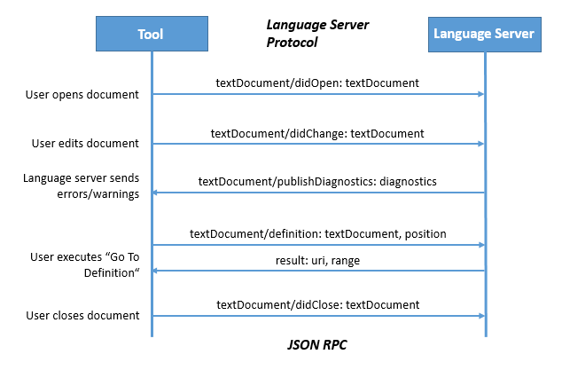

# Making Dotty More Robust
[Guillaume Martres](http://guillaume.martres.me) - EPFL

<!-- .element: style="text-align: center !important" -->
--
## sbt-based bootstrap
- <!-- .element: class="fragment" --> Existing bootstrap broken
- <!-- .element: class="fragment" --> Using sbt makes bootstrapped build a first-class citizen
  - <!-- .element: class="fragment" --> Runs JUnit-only test (REPL tests, ...)
  - <!-- .element: class="fragment" --> Easy to use interactively
  - <!-- .element: class="fragment" --> Compiler jar contains `compiler.properties`
  - <!-- .element: class="fragment" --> Stress-test incremental compilation
  - <!-- .element: class="fragment" --> Easier to publish
--
## Hunting bugs
- Recursive lazy vals semantics ([#1856](https://github.com/lampepfl/dotty/issues/1856))
- `TreeTypeMap`
  ([#1770](https://github.com/lampepfl/dotty/pull/1770),
  [#1810](https://github.com/lampepfl/dotty/issues/1810),
  [#1812](https://github.com/lampepfl/dotty/issues/1812))
- Bringing symbols to new runs ([#1895](https://github.com/lampepfl/dotty/issues/1895))
-- <!-- .element: data-transition="slide-in"  -->
## Dotty finds bugs in itself!
``` scala
sealed trait NegTestState
case class CompFailed() extends NegTestState
case class CompSucceeded() extends NegTestState

val failureStates =
  ... match {
    case ... => CompSucceeded
    case ... => CompFailed
  }

failureStates.exists({
  case CompFailed() =>
    true
  case _ =>
    false
})
```
-- <!-- .element: data-transition="slide-out"  -->
## Dotty finds bugs in itself!
``` scala
sealed trait NegTestState
case class CompFailed() extends NegTestState
case class CompSucceeded() extends NegTestState

val failureStates /* : CompSucceeded.type | CompFailed.type */ =
  ... match {
    case ... => CompSucceeded
    case ... => CompFailed
  }

failureStates.exists({
  case CompFailed() => // error: CompFailed is neither subtype
    true               // nor supertype of selector type
  case _ =>
    false
})
```
--
## IDE support in Dotty
- <!-- .element: class="fragment" --> Based on the [Language Server Protocol](https://github.com/Microsoft/language-server-protocol)


<!-- .element: class="fragment" -->

<!-- .element: style="text-align: center !important" -->
--
## Limitations
- <!-- .element: class="fragment" --> Few clients (check out [langserver.org](http://langserver.org))
- <!-- .element: class="fragment" --> Only one kind of refactoring: renaming symbols
- <!-- .element: class="fragment" --> Limited support for language-specific actions
- <!-- .element: class="fragment" --> Under active development!
--
## The Dotty Language Server
- <!-- .element: class="fragment" --> Based on [Eclipse LSP4J](https://github.com/eclipse/lsp4j)

``` scala
override def definition(params: TextDocumentPositionParams) =
  computeAsync { cancelToken =>
    implicit val ctx = driver.ctx

    val trees = driver.trees
    val spos = driver.sourcePosition(
      new URI(params.getTextDocument.getUri), params.getPosition)
    val sym = Interactive.enclosingSymbol(trees, spos)

    Interactive.definitions(trees, sym).map(asLocation).asJava
  }
```
<!-- .element: class="fragment" -->
--
## Future work
- <!-- .element: class="fragment" --> Easy startup
- <!-- .element: class="fragment" --> Testing
- <!-- .element: class="fragment" --> Optimizations
- <!-- .element: class="fragment" --> Build tool integration
--
## Dotty as an interactive compiler
- <!-- .element: class="fragment" --> It works!
- <!-- .element: class="fragment" --> All issues found so far have been solvable
- <!-- .element: class="fragment" --> Common issue: accidentally using a `Context` from a previous run
  - <!-- .element: class="fragment" --> In a few place: old `Context` reached by traversing `Context#outer` chain
  - <!-- .element: class="fragment" --> In many places: accidental closure capture of `Context`
--
## Closure leaks detection
- <!-- .element: class="fragment" --> MacroPhase: [`CheckClosures`](https://github.com/dotty-staging/dotty/commits/checkClosures)
- <!-- .element: class="fragment" --> Two annotations:
  - <!-- .element: class="fragment" --> `@checkCaptures` on all types whose capture should be checked
  - <!-- .element: class="fragment" --> `@allowCaptures` on the expected type of closures that should be checked
--
## Case Study
- <!-- .element: class="fragment" --> Annotated `Context` with `@allowCaptures`
- <!-- .element: class="fragment" --> ~170 annotations added:
  - <!-- .element: class="fragment" --> ~150 on `def` parameters
  - <!-- .element: class="fragment" --> ~10 on constructor parameters
  - <!-- .element: class="fragment" --> ~10 on `val` return type
- <!-- .element: class="fragment" --> ~10 issues found
--
## Recognizing leaks
- ...

--
## To make Dotty stronger we must first break it
