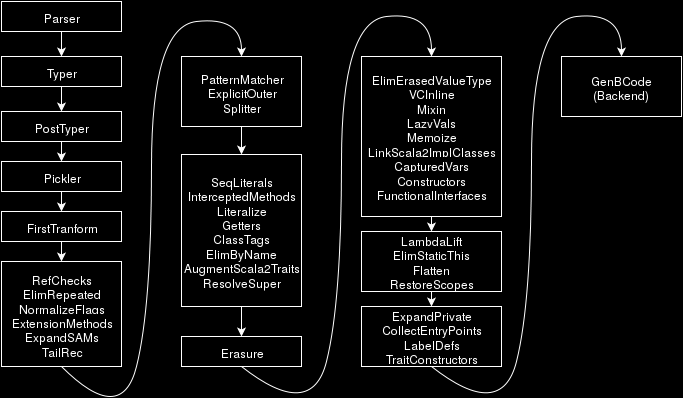
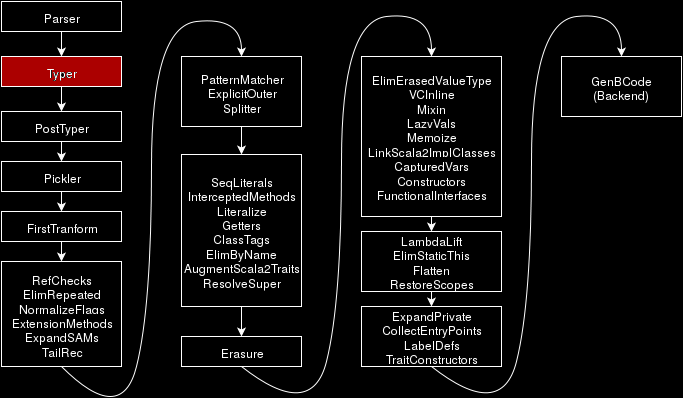
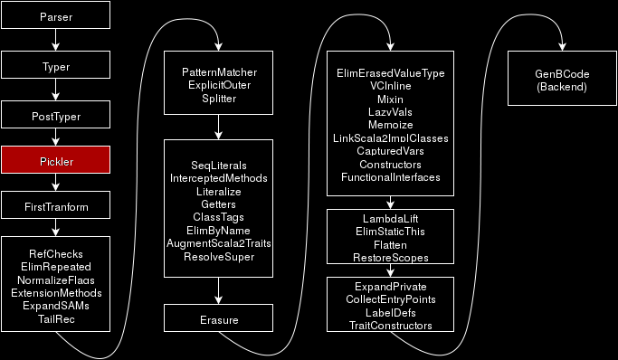

# Integrating IDE<span style="text-transform: none;">s</span> with Dotty
[Guillaume Martres](http://guillaume.martres.me) - EPFL

<!-- .element: style="text-align: center !important" -->
--
## What is Dotty?
- <!-- .element: class="fragment" --> Research compiler that will become Scala 3
- <!-- .element: class="fragment" --> Type system internals redesigned, inspired by DOT, but externally very similar
- <!-- .element: class="fragment" --> More info:
  - [dotty.epfl.ch](dotty.epfl.ch)
  - Recent blog posts on [scala-lang.org](scala-lang.org)
--
## A chance to redesign components
- <!-- .element: class="fragment" --> Improved incremental compilation (avoid undercompilation)
- <!-- .element: class="fragment" --> Better pattern matching checks
  ([algorithm now reused in Swift!](https://github.com/apple/swift/pull/8908))

--
## Tooling
A good developer experience requires good tools:
- <!-- .element: class="fragment" --> A REPL (with syntax highlighting!)
- <!-- .element: class="fragment" --> Dottydoc (used to generate [dotty.epfl.ch/docs](http://dotty.epfl.ch/docs))
- <!-- .element: class="fragment" --> **IDE support**

-- <!-- .element: data-transition="slide-in"  -->
## State of the art
- <!-- .element: class="fragment" data-fragment-index="1" --> Based on the [Scala Presentation Compiler](https://github.com/scala/scala/tree/2.12.x/src/interactive/scala/tools/nsc/interactive)
  - <!-- .element: class="fragment" --> Scala-IDE
  - <!-- .element: class="fragment" --> ENSIME
- <!-- .element: class="fragment" --> Reimplementation of the Scala typechecker
  - <!-- .element: class="fragment" --> Scala plugin for IntelliJ IDEA
-- <!-- .element: data-transition="slide-out"  -->
## State of the art
- Based on the [Scala Presentation Compiler](https://github.com/scala/scala/tree/2.12.x/src/interactive/scala/tools/nsc/interactive) (<span style="color: orangered;">3 KLOC</span>)
  - Scala-IDE (<span style="color: orangered;">66 KLOC</span>)
  - ENSIME (server: <span style="color: orangered;">15 KLOC</span>, emacs client: <span style="color: orangered;">10 KLOC</span>)
- Reimplementation of the Scala typechecker
  - Scala plugin for IntelliJ IDEA (<span style="color: orangered;">230 KLOC</span>)
-- <!-- .element: data-transition="slide-in"  -->
## Design principles
1. <!-- .element: class="fragment" --> Code reuse
2. <!-- .element: class="fragment" --> Editor-agnosticity
3. <!-- .element: class="fragment" --> Easy to use (and to install!)
-- <!-- .element: data-transition="slide-out"  -->
## Design principles
1. <span style="color: orangered;"> Code reuse </span>
2. <span style="opacity: 0.5;"> Editor-agnosticity </span>
3. <span style="opacity: 0.5;"> Easy to use (and to install!) </span>
<!-- -- -->
<!-- # Part 1 -->
<!-- ## Interactive API<span style="text-transform: none;">s</span> based on reusable primitives -->
--<!-- .element: data-transition="slide-in"  -->
## Querying the compiler

- <!-- .element: class="fragment"  --> Each phase progressively simplify trees until they can be emitted as JVM bytecode
--<!-- .element: data-transition="slide-out"  -->
## Querying the compiler

- Each phase progressively simplify trees until they can be emitted as JVM bytecode
-- <!-- .element: data-transition="slide-in"  -->
## Source code
```scala
  final val elem = 1

  val foo = elem🚩 + 1
```

- <!-- .element: class="fragment" -->  Cursor position = 🚩
- <!-- .element: class="fragment" -->  Query: jump to definition
-- <!-- .element: data-transition="none"  -->
## Tree after typechecking
```scala
  final val elem: 1 = 1

  val foo: Int = elem + 1
```
- <!-- .element: class="fragment" --> Every tree node has a type and a position
- <!-- .element: class="fragment" --> Query can be answered
-- <!-- .element: data-transition="slide-out"  -->
## Tree after constant folding
```scala
  final val elem: 1 = 1

  val foo: Int = 2
```
- <!-- .element: class="fragment" -->  Information lost by constant folding
- <!-- .element: class="fragment" --> Impossible to answer query
--
## Querying the compiler
- <!-- .element: class="fragment" --> Store trees right after typechecking
- <!-- .element: class="fragment" --> Respond to IDE queries by traversing trees
- <!-- .element: class="fragment" --> What about code that has already been compiled?
--
## Pickling

- <!-- .element: class="fragment" --> In Scala 2: store methods signatures (for separate compilation)
- <!-- .element: class="fragment" --> In Dotty: store full trees
--
## TASTY: Typed AST serialization format
- <!-- .element: class="fragment" --> Original motivation: solve the [binary compatibility problem](https://www.slideshare.net/Odersky/scalax)
  - <!-- .element: class="fragment" --> Always use JVM bytecode: breaks when compiler encoding changes
  - <!-- .element: class="fragment" --> Always recompile source code: breaks when the typechecker changes
- <!-- .element: class="fragment" --> Can also be used to provide interactive features: deserialize and query trees
--
## Interactive APIs
-  <!-- .element: class="fragment" --> Convenience methods for tree traversals, compiler lifecycle management
-  <!-- .element: class="fragment" --> Used both in the IDE and the REPL (e.g., for completions)
-  <!-- .element: class="fragment" --> In the future: interruption handling, partial typechecking, ...
-  <!-- .element: class="fragment" --> Less then <span style="color: orangered;">1 KLOC</span>
--
## Design principles
1. <span style="opacity: 0.5;"> Code reuse </span>
2. <span style="color: orangered;"> Editor-agnosticity </span>
3. <span style="opacity: 0.5;"> Easy to use (and to install!) </span>
<!-- -- -->
<!-- # Part 2 -->
<!-- ## Editor-agnosticity -->
--
## The IDE Portability Problem
Getting <em style="font-family: serif;">m</em> IDEs to support <em style="font-family: serif;">n</em> programming languages requires <em style="font-family: serif;">m*n</em> IDE plugins.
<!-- Developing IDE plugin require expertise both in compiler internals and IDE internals. -->
--
## The Language Server Protocol


<!-- .element: style="text-align: center !important" -->
--
## Basics of the LSP
- <!-- .element: class="fragment" --> First implemented in Visual Studio Code
- <!-- .element: class="fragment" --> JSON-RPC
- <!-- .element: class="fragment" --> IDE notifies the language server about user actions
- <!-- .element: class="fragment" --> LS maintains internal representation of code
- <!-- .element: class="fragment" --> LS notify IDE about warnings/errors
- <!-- .element: class="fragment" --> IDE can send requests usually triggered by user actions
- <!-- .element: class="fragment" --> Asynchronous, cancelable
--
<!-- ## Limitations -->
<!-- - Few IDEs support it well currently -->
<!-- - Only one kind of refactoring: renaming -->
<!-- -- -->
## Implementing the Dotty Language Server
- <!-- .element: class="fragment" --> Low-level message handling done by [Eclipse LSP4J](https://github.com/eclipse/lsp4j)
- <!-- .element: class="fragment" --> Relies on interactive APIs
- <!-- .element: class="fragment" --> <span style="color: orangered;">0.5 KLOC</span>
-- <!-- .element: data-transition="slide-in"  -->
```scala
override def definition(params: TextDocumentPositionParams) =


  }
```
-- <!-- .element: data-transition="none"  -->
```scala
override def definition(params: TextDocumentPositionParams) =
  computeAsync { cancelToken =>


  }
```
-- <!-- .element: data-transition="none"  -->
```scala
override def definition(params: TextDocumentPositionParams) =
  computeAsync { cancelToken =>
    val uri = new URI(params.getTextDocument.getUri)


  }
```
-- <!-- .element: data-transition="none"  -->
```scala
override def definition(params: TextDocumentPositionParams) =
  computeAsync { cancelToken =>
    val uri = new URI(params.getTextDocument.getUri)
    val driver = driverFor(uri)


  }
```
-- <!-- .element: data-transition="none"  -->
```scala
override def definition(params: TextDocumentPositionParams) =
  computeAsync { cancelToken =>
    val uri = new URI(params.getTextDocument.getUri)
    val driver = driverFor(uri)
    implicit val ctx = driver.currentCtx


  }
```
-- <!-- .element: data-transition="none"  -->
```scala
override def definition(params: TextDocumentPositionParams) =
  computeAsync { cancelToken =>
    val uri = new URI(params.getTextDocument.getUri)
    val driver = driverFor(uri)
    implicit val ctx = driver.currentCtx

    val pos = sourcePosition(driver, uri, params.getPosition)


  }
```
-- <!-- .element: data-transition="none"  -->
```scala
override def definition(params: TextDocumentPositionParams) =
  computeAsync { cancelToken =>
    val uri = new URI(params.getTextDocument.getUri)
    val driver = driverFor(uri)
    implicit val ctx = driver.currentCtx

    val pos = sourcePosition(driver, uri, params.getPosition)
    val uriTrees = driver.openedTrees(uri)


  }
```
-- <!-- .element: data-transition="none"  -->
```scala
override def definition(params: TextDocumentPositionParams) =
  computeAsync { cancelToken =>
    val uri = new URI(params.getTextDocument.getUri)
    val driver = driverFor(uri)
    implicit val ctx = driver.currentCtx

    val pos = sourcePosition(driver, uri, params.getPosition)
    val uriTrees = driver.openedTrees(uri)
    val sym = Interactive.enclosingSourceSymbol(uriTrees, pos)


  }
```
-- <!-- .element: data-transition="none"  -->
```scala
override def definition(params: TextDocumentPositionParams) =
  computeAsync { cancelToken =>
    val uri = new URI(params.getTextDocument.getUri)
    val driver = driverFor(uri)
    implicit val ctx = driver.currentCtx

    val pos = sourcePosition(driver, uri, params.getPosition)
    val uriTrees = driver.openedTrees(uri)
    val sym = Interactive.enclosingSourceSymbol(uriTrees, pos)

    val classTree =
      SourceTree.fromSymbol(sym.topLevelClass.asClass).toList


  }
```
-- <!-- .element: data-transition="none"  -->
```scala
override def definition(params: TextDocumentPositionParams) =
  computeAsync { cancelToken =>
    val uri = new URI(params.getTextDocument.getUri)
    val driver = driverFor(uri)
    implicit val ctx = driver.currentCtx

    val pos = sourcePosition(driver, uri, params.getPosition)
    val uriTrees = driver.openedTrees(uri)
    val sym = Interactive.enclosingSourceSymbol(uriTrees, pos)

    val classTree =
      SourceTree.fromSymbol(sym.topLevelClass.asClass).toList
    val defTree = Interactive.definition(classTree, sym)

  }
```
-- <!-- .element: data-transition="none"  -->
```scala
override def definition(params: TextDocumentPositionParams) =
  computeAsync { cancelToken =>
    val uri = new URI(params.getTextDocument.getUri)
    val driver = driverFor(uri)
    implicit val ctx = driver.currentCtx

    val pos = sourcePosition(driver, uri, params.getPosition)
    val uriTrees = driver.openedTrees(uri)
    val sym = Interactive.enclosingSourceSymbol(uriTrees, pos)

    val classTree =
      SourceTree.fromSymbol(sym.topLevelClass.asClass).toList
    val defTree = Interactive.definition(classTree, sym)
    defTree.map(d => location(d.namePos)).asJava
  }
```

--
## Design principles
1. <span style="opacity: 0.5;"> Code reuse </span>
2. <span style="opacity: 0.5;"> Editor-agnosticity </span>
3. <span style="color: orangered;"> Easy to use (and to install!) </span>
--
## sbt integration
- <!-- .element: class="fragment" --> Analyze the build to find Dotty projects
- <!-- .element: class="fragment" --> Compile these projects
- <!-- .element: class="fragment" --> Generate configuration files
- <!-- .element: class="fragment" --> Install the Dotty VSCode extension
- <!-- .element: class="fragment" --> Launch VSCode
--
## Configuration files
- `.dotty-ide-artifact`, used by the IDE extension to launch the Dotty Language Server:
```plain
ch.epfl.lamp:dotty-language-server_0.8:0.8.0-RC1
```
--
## Configuration files
- `.dotty-ide.json`, used by the DLS to launch compiler instances:

```json
[
  {
    "id" : "root/compile",
    "compilerVersion" : "0.8.0-RC1",
    "compilerArguments" : [ ],
    "sourceDirectories" : [ "src/main/scala" ],
    "dependencyClasspath" : [ ... ],
    "classDirectory" : "target/scala-0.8/classes"
  },
  {
    "id" : "root/test",
     ...
  },
  ...
]

```
--
## Build Server Protocol
-  <!-- .element: class="fragment" --> Instead of making plugins for build tools to extract information, ask them!
-  <!-- .element: class="fragment" --> We also need a discovery protocol: "How do I start a build server for this project?"
--
## Design principles, revisited
1. Code reuse
   - <!-- .element: class="fragment" --> Compiler APIs for interactive usage
2. Editor-agnosticity
   - <!-- .element: class="fragment" --> Implemented the LSP
3. Easy to use (and to install!)
   - <!-- .element: class="fragment" --> One command (but we can do better!)
--
## Going Further: Debugger Support
- <!-- .element: class="fragment" --> Based on the [Java Debug Server](https://github.com/Microsoft/java-debug)
- <!-- .element: class="fragment" --> Most features "just work"
- <!-- .element: class="fragment" --> (Not actually merged in Dotty yet)
- <!-- .element: class="fragment" --> Challenge: expression evaluation
-- <!-- .element: data-transition="none"  -->
## Expression Evaluation
``` scala
class Hello {
  def foo(implicit y: Context): String = { /*...*/ }
  def bar(implicit y: Context) = {

    /*...*/
  }
}
```

-- <!-- .element: data-transition="none"  -->
## Expression Evaluation
``` scala
class Hello {
  def foo(implicit y: Context): String = { /*...*/ }
  def bar(implicit y: Context) = {
🚩
    /*...*/
  }
}
```

-- <!-- .element: data-transition="none"  -->
## Expression Evaluation
``` scala
class Hello {
  def foo(implicit y: Context): String = { /*...*/ }
  def bar(implicit y: Context) = {
🚩  foo
    /*...*/
  }
}
```

-- <!-- .element: data-transition="none"  -->
## Run the compiler pipeline
``` scala
class Hello {
  def foo(y: Context): String = { /*...*/ }
  def bar(y: Context) = {
🚩  this.foo(y)
    /*...*/
  }
}
```

-- <!-- .element: data-transition="none"  -->
## Extract to a static method
``` scala
object Global {
  def liftedExpr($this: Hello, y: Context) =
    $this.foo(y)
    


}
```

-- <!-- .element: data-transition="none"  -->
## Extract to a static method
``` scala
object Global {
  def liftedExpr($this: Hello, y: Context) =
    $this.foo(y)
    
  def exec(self: Object, localVariables: Map[String, Object]) =
    liftedExpr(
      self.asInstanceOf[Hello],
      localVariables("y").asInstanceOf[Context]
    )
}

```

-- <!-- .element: data-transition="none"  -->
## On the debugging VM
- <!-- .element: class="fragment" --> Compile `Global` to a classfile
- <!-- .element: class="fragment" --> Load it in the debugged VM
- <!-- .element: class="fragment" --> Call `Global.exec` with the right arguments

-- <!-- .element: data-transition="none"  -->
## On the debugged VM

- In the standard library

``` scala
package dotty.runtime

object DebugEval {
  def eval(classpath: String,
           self: Object,
           localVariables: Map[String, Object]): Any = {
    val cl = new URLClassLoader(Array(new URL("file://" + classpath)))
    val cls = cl.loadClass("Global")
    val instance = cls.newInstance

    val exec = cls.getMethod("exec")
    exec.invoke(instance, self, names, args)
  }
}
```
--
## On the debugging VM
We want to remotely execute:
``` scala
val classpath = <classpath for the compiled Global class>
val self = <this in the stackframe>
val localVariables = <map of local variables in the stackframe>
dotty.runtime.DebugEval(classpath, self, localVariables)
```
--
## On the debugging VM
We use the Java Debugging Interface APIs:
``` scala
val vars = stackFrame.visibleVariables
val mapCls =
  vm.classesByName("java.util.Map")
    .get(0).asInstanceOf[ClassType]
val localVariablesRef = mapCls.newInstance()
// Skipped: store `vars` into `localVariablesRef`
val debugCls =
  vm.classesByName("dotty.runtime.DebugEval")
    .get(0).asInstanceOf[ClassType]
val eval =
  debugCls.methodsByName("eval").get(0)
debugCls.invokeMethod(
  thread, eval,
  List(vm.mirrorOf(classpath), stackFrame.thisObject,
       localVariablesRef)
)
```

--
## Future work
- <!-- .element: class="fragment" --> Optimizations
- <!-- .element: class="fragment" --> More features
  - <!-- .element: class="fragment" --> Documentation on hover
- <!-- .element: class="fragment" --> Better build tool integration (Build Server Protocol!)
--
## Conclusion
- <!-- .element: class="fragment" --> Design your compiler with interactivity in mind
- <!-- .element: class="fragment" --> Design your build tool with interactivity in mind
- <!-- .element: class="fragment" --> Interactivity should go beyond what IDEs and REPLs currently offer
  - <!-- .element: class="fragment" --> [Type Driven Development with Idris](https://www.manning.com/books/type-driven-development-with-idris)
--
## Questions ?
- More info: [dotty.epfl.ch](dotty.epfl.ch)
- Come chat with us: [gitter.im/lampepfl/dotty](http://gitter.im/lampepfl/dotty)
- Contributors welcome!
